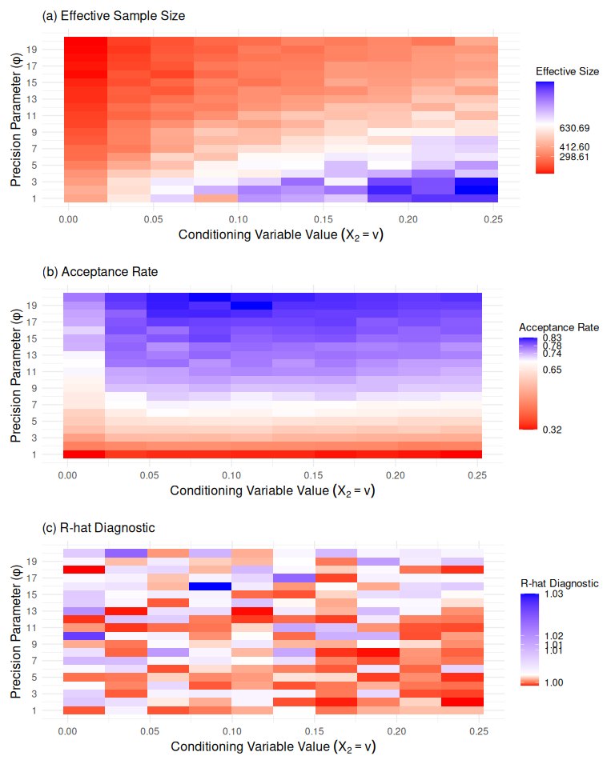

RandomSample
================

## Distribución Condicional de X_1 dado X_2.

Se establecen los valores de hiperparámetros phi=(a1,b1,c1,d1) y se
construye la gráfica de la distribución condicional de X_1 dado X_2.

``` r
a1=2.2; b1=2.2; c1=2.2; d1=2.2
Graph_Fc_X1(v1 = 0.05,"v=0.05",v2 = 0.10,"v=0.10",v3 = 0.20,"v=0.20",ae = a1,be = b1,ce = c1,de = d1)
```

<!-- -->

### Monitoreo de convergencia método de simulación

Function to monitor the acceptance rate and effective size for different
values of variance (v_values) and precision (prop_prec) provided

``` r
Mon_Measure(N=10^4, prop_prec_values=seq(1, 20, by = 1), a=a1, b=b1, c=c1, d=d1, v_values=seq(0.01, 0.24, length.out = 10),thin = 5,burnin = 500)
```

<!-- --><!-- -->

Function to monitor the R-Hat for different values of variance
(s_values) and precision (prop_prec) provided

``` r
Mon_R_Hat(N=10^4, prop_prec_values=seq(1, 20, by = 1), a=a1, b=b1, c=c1, d=d1, v_values=seq(0.01, 0.24, length.out = 10),thin = 5,burnin = 500)
```

<!-- -->

## Muestra aleatoria para la distribución condicional de X1 dado X2

El ejemplo de simulación de una muestra de tamaño N=10000 (thin=100)
with given values of a, b, c, d and variance (s) es generada a
continuación, Plot of Histogram and density, trace, convergence control
using averaging and autocorrelation function.

``` r
N=10^4
ExampleFC_X1_X2=Gen_FC_X1_X2(N,prop_prec = 3,a=a1,b=b1,c=c1,d=d1,v=0.1,option="all", thin = 1, burnin = 50,X10_given = "random",target_acceptance = 0.4,dig_tol=5)
Graphs(as.data.frame(ExampleFC_X1_X2$thinned_chain[seq(1, length(ExampleFC_X1_X2$thinned_chain), by = 1)]),"X1", width = 40,lscatt = 0.005,uscatt = 0.005)
```

    ## `stat_bin()` using `bins = 30`. Pick better value with `binwidth`.

<!-- -->

La tasa de aceptación, tamaño de muestra efectiva y longitud de la
cadena generada en ExampleFC_X1_X2 fue:

``` r
data.frame("Acceptance Rate"=ExampleFC_X1_X2$acc_rate,"Acceptance Rate Post Burnin"=ExampleFC_X1_X2$acc_rate_pos_burnin, "ESS"=effectiveSize(ExampleFC_X1_X2$thinned_chain),"Length"=length(ExampleFC_X1_X2$thinned_chain), "Precision"=ExampleFC_X1_X2$precision)
```

### Monitoreo de convergencia con nueve semillas fijas

``` r
N=10^3
seedgiv=seq(0.1,0.9,0.1)
ExampleFC_X1_X2_seedgiven=matrix(data=NA,nrow = length(seq(101, N, by = 5)),ncol=9, dimnames=list(list(),list("0.1","0.2","0.3","0.4","0.5","0.6","0.7","0.8","0.9")))
for (i in 1:9) {
  ExampleFC_X1_X2_seedgiven[,i]=Gen_FC_X1_X2(N=N,prop_prec = 4,a=a1,b=b1,c=c1,d=d1,v=0.05,option="all", thin = 5,burnin = 100,X10_given = seedgiv[i])$thinned_chain
}
ExampleFC_X1_X2_seedgiven=as.data.frame(ExampleFC_X1_X2_seedgiven)

# Matrix of cumsum of all simulations obtained.
N=nrow(ExampleFC_X1_X2_seedgiven)
ExampleFC_X1_X2_seedgiven_cum=apply(ExampleFC_X1_X2_seedgiven,2,cumsum)/(1:N)
ExampleFC_X1_X2_seedgiven_cum=as.data.frame(ExampleFC_X1_X2_seedgiven_cum)

# Matrix organization for plotting.
ExampleFC_X1_X2_seedgiven_cum=gather(ExampleFC_X1_X2_seedgiven_cum,key="Seed",value="FCmu")
ExampleFC_X1_X2_seedgiven_cum$Sim=rep(1:N,9)
# Graphic
Piece1_Grap_FC=ggplot(ExampleFC_X1_X2_seedgiven_cum,aes(x=Sim ,y=FCmu,group= Seed, color=Seed))+geom_line()+ylab(expression(hat(X)[1]^(t)))+xlab("t")+xlim(0,50)

Piece2_Grap_FC=ggplot(ExampleFC_X1_X2_seedgiven_cum,aes(x=Sim ,y=FCmu,group= Seed, color=Seed))+geom_line()+ylab(expression(hat(X)[1]^(t)))+xlab("t")+xlim(0,250)

Full_Grap_FC=ggplot(ExampleFC_X1_X2_seedgiven_cum,aes(x=Sim ,y=FCmu,group= Seed, color=Seed))+geom_line()+ylab(expression(hat(X)[1]^(t)))+xlab("t")

grid.arrange(arrangeGrob(Piece1_Grap_FC, Piece2_Grap_FC, Full_Grap_FC,ncol=2, nrow=2, widths=c(2, 2), heights=c(2,2),layout_matrix=rbind(c(1,2),c(3,3))),bottom="Convergence control using averaging")
```

<!-- -->

## Including Plots

You can also embed plots, for example:

<!-- -->

Note that the `echo = FALSE` parameter was added to the code chunk to
prevent printing of the R code that generated the plot.
