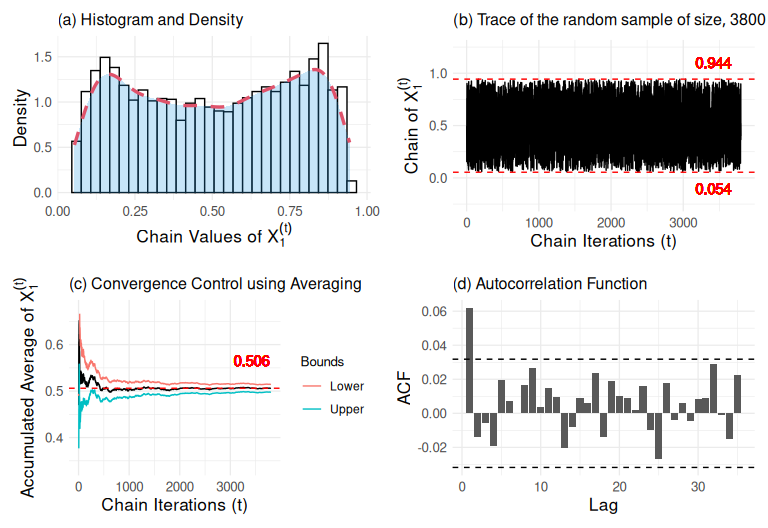
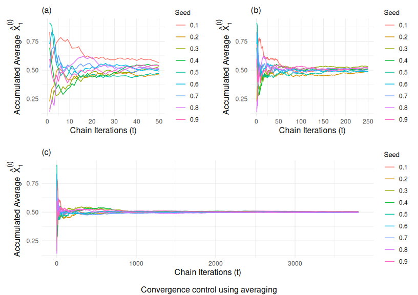
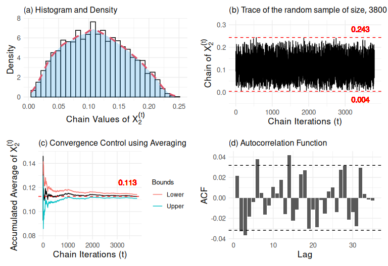
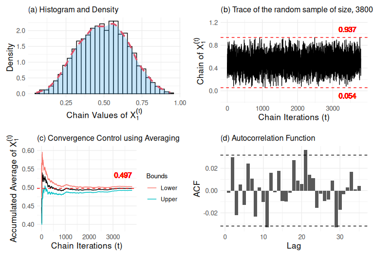
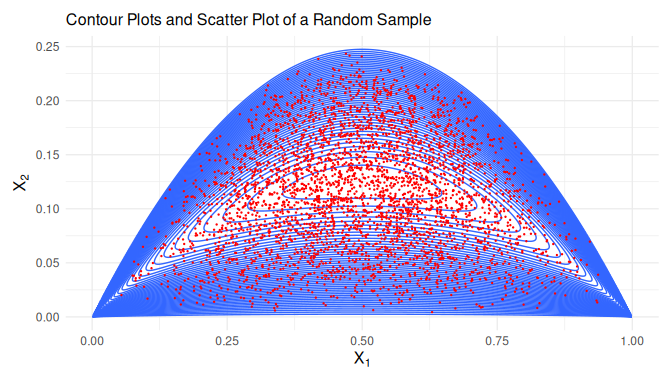
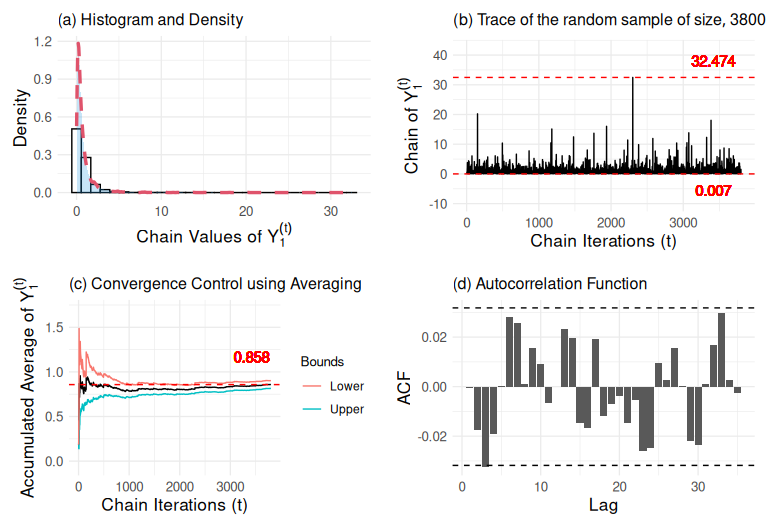
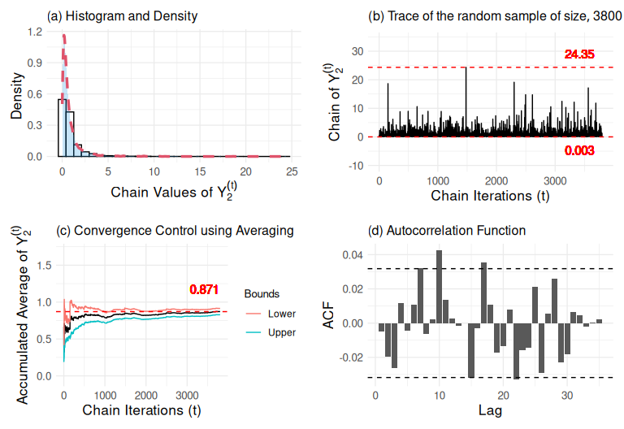

RandomSample
================

# Introduction

This document presents a simulation method for generating random samples
from a new bivariate probability distribution with parameters
$\phi=(a,b,c,d)$, and a probability density function.

$$
f_{\phi}(y_1,y_2)= \dfrac{1}{beta(a,b)beta(c,d)}\ y_1^{a-1}y_2^{b-1}(y_1+y_2)^{d-(a+b)} (y_1+y_2+1)^{-c-d},\hspace{1cm}y_1,y_2\in\mathbb{R}^+
$$

and a joint moment of order $l = l_1 + l_2$ determined by

$$
E_{\phi}[Y_1^{l_1} Y_2^{l_2}] \propto beta(c-l,l+d)\times beta(l_1+a,l_2+b)
$$

provided that $c > 2$.

The presented method uses the Metropolis-Hastings method with a random
walk to generate samples from the conditional distribution $X_1$ given
$X_2$. Subsequently, Gibbs Sampling is used to generate samples from the
random vector $(X_1, X_2)$, and finally, samples for the vector
$(Y_1, Y_2)$ are obtained through the transformation.

$$
(Y_1,Y_2)=\left(X_1\left(\dfrac{X_1(1-X_1)}{X_2}-1\right),(1-X_1)\left(\dfrac{X_1(1-X_1)}{X_2}-1\right)\right).
$$

# Generating Samples of $X_1$ Given $X_2$

## Conditional Distribution of $X_1$ Given $X_2$

The conditional density function of $X_1$ given $X_2 = v$ is

$$
f_{\phi}(x_1|x_2)\propto x_1^{a-c-d}(x_1(1-x_1)-x_2)^{d-1}(1-x_1)^{b-c-d}
$$

By setting the hyperparameter values
$\phi = (a1, b1, c1, d1) = (2.2, 2.2, 2.2, 2.2)$, the graph is
constructed for three values of $X_2$.

``` r
a1=2.2; b1=2.2; c1=2.2; d1=2.2
Graph_Fc_X1(v1 = 0.05,"v=0.05",v2 = 0.10,"v=0.10",v3 = 0.20,"v=0.20",ae = a1,be = b1,ce = c1,de = d1)
```

<!-- -->

It is observed that the conditional density is symmetric for the
configuration of $\phi$ values and that it decreases for $X_2$ values
close to 0.25.

## Metropolis-Hastings Algorithm with Random Walk

Using the Metropolis-Hastings Algorithm with Random Walk (MHARW), a
chain of size $N=10^5$ is generated with a precision of 3 in the
proposal distribution, a thinning of 25, and a burn-in of 5000. The
graph of the resulting density shows a similar behavior to the one
obtained previously.

``` r
test=Gen_FC_X1_X2(N=10^5, prop_prec=3, a=a1, b=b1, c=c1, d=d1, v=0.05, option = "all", thin=25, burnin=5000,target_acceptance = 0.4)
plot(density(test$thinned_chain),main="Conditional Distribution Density of X_1 Given X_2",xlab=expression(x[1]))
```

<!-- -->

## Convergence Monitoring of the Simulation Method

To monitor the convergence of the chain from the designed algorithm, the
acceptance rate and the effective sample size are tracked for different
values of the precision (used in the proposal distribution) versus
values of $X_2 = v$.

``` r
Mon_Measure(N=10^4, prop_prec_values=seq(1, 20, by = 1), a=a1, b=b1, c=c1, d=d1, v_values=seq(0.01, 0.24, length.out = 10),thin = 5,burnin = 1000,target_acceptance = 0.4)
```

<!-- -->

The ideal behavior sought is for the acceptance rate to remain between
0.3 and 0.7, while the effective sample size stays close to the
generated sample size. For the configuration of the previous graphs, the
effective sample size should be above 465 and close to
$(10^4 - 1000) / 5 = 1800$. The presented graphs allow for determining
the value of the precision based on the value of $X_2$.

The following graph shows the behavior of the R-Hat indicator
(Gelman-Rubin), which is used to compare the variability between several
chains with the variability within each chain. An R-Hat value close to 1
indicates that the chains have converged to the same distribution,
suggesting that the generated samples are representative of the
distribution. If the R-Hat value is significantly greater than 1, it is
recommended to continue the simulation to ensure better convergence and
obtain more accurate estimates.

``` r
Mon_R_Hat(N=10^4, prop_prec_values=seq(1, 20, by = 1), a=a1, b=b1, c=c1, d=d1, v_values=seq(0.01, 0.24, length.out = 10),thin = 5,burnin = 1000,target_acceptance = 0.4)
```

<!-- -->

## Another random sample generated for the conditional distribution of $X_1$ given $X_2$

Another sample of size $N=10^5$ is generated using
$\phi = (2.2, 2.2, 2.2, 2.2)$ with a precision of 3, thinning of 25,
burn-in of 5000, $X_2 = v = 0.05$, and target acceptance of 0.4. This
latter value controls the increase or decrease of the precision during
the simulation, meaning the algorithm adjusts itself, which allows for a
rapid reduction in the autocorrelation of the chain.

``` r
ExampleFC_X1_X2=Gen_FC_X1_X2(N=10^5, prop_prec = 3, a=a1, b=b1, c=c1, d=d1, v=0.05, option="all",thin = 25, burnin = 5000, X10_given = "random", target_acceptance = 0.4, dig_tol=15)
Graphs(as.data.frame(ExampleFC_X1_X2$thinned_chain), "X1", width = 40, lscatt = 0.3, uscatt = 0.3)
```

    ## `stat_bin()` using `bins = 30`. Pick better value with `binwidth`.

<!-- -->

For the results of ExampleFC_X1_X2, the following table presents the
acceptance rate before and after the burn-in period, the effective
sample size, chain length, and the adjusted precision value. The
adjustment period corresponds to the burn-in segment of the chain.

``` r
data.frame("Acceptance Rate"=ExampleFC_X1_X2$acc_rate,"Acceptance Rate Post Burnin"=ExampleFC_X1_X2$acc_rate_pos_burnin, "ESS"=effectiveSize(ExampleFC_X1_X2$thinned_chain),"Length"=length(ExampleFC_X1_X2$thinned_chain), "Precision"=ExampleFC_X1_X2$precision)
```

    ##      Acceptance.Rate Acceptance.Rate.Post.Burnin      ESS Length Precision
    ## var1       0.8551686                   0.8611985 1103.187   3800   34.4022

## Convergence Monitoring with Fixed Seeds

The previously simulated samples assumed that the seed was generated
randomly. Now, we consider nine user-specified seeds and monitor the
convergence of the mean of each generated chain.

``` r
N=10^5;burnin=5000;thin=25; target_acceptance=0.4
seedgiv=seq(0.1,0.9,0.1)
ExampleFC_X1_X2_seedgiven=matrix(data=NA,nrow = length(seq((burnin+1), N, by = thin)),ncol=9,dimnames=list(list(),list("0.1","0.2","0.3","0.4","0.5","0.6","0.7","0.8","0.9")))
for (i in 1:9) {
  ExampleFC_X1_X2_seedgiven[,i]=Gen_FC_X1_X2(N=N, prop_prec = 3, a=a1, b=b1, c=c1, d=d1, v=0.05, option="all", thin = thin, burnin = burnin, X10_given = seedgiv[i], dig_tol = 10,target_acceptance)$thinned_chain
}
ExampleFC_X1_X2_seedgiven=as.data.frame(ExampleFC_X1_X2_seedgiven)

# Matrix of cumsum of all simulations obtained.
N=nrow(ExampleFC_X1_X2_seedgiven)
ExampleFC_X1_X2_seedgiven_cum=apply(ExampleFC_X1_X2_seedgiven,2,cumsum)/(1:N)
ExampleFC_X1_X2_seedgiven_cum=as.data.frame(ExampleFC_X1_X2_seedgiven_cum)

# Matrix organization for plotting.
ExampleFC_X1_X2_seedgiven_cum=gather(ExampleFC_X1_X2_seedgiven_cum,key="Seed",value="FCmu")
ExampleFC_X1_X2_seedgiven_cum$Sim=rep(1:N,9)
# Graphic
Piece1_Grap_FC=ggplot(ExampleFC_X1_X2_seedgiven_cum,aes(x=Sim ,y=FCmu,group= Seed, color=Seed))+geom_line()+ylab(expression(hat(X)[1]^(t)))+xlab("t")+xlim(0,50)

Piece2_Grap_FC=ggplot(ExampleFC_X1_X2_seedgiven_cum,aes(x=Sim ,y=FCmu,group= Seed, color=Seed))+geom_line()+ylab(expression(hat(X)[1]^(t)))+xlab("t")+xlim(0,250)

Full_Grap_FC=ggplot(ExampleFC_X1_X2_seedgiven_cum,aes(x=Sim ,y=FCmu,group= Seed, color=Seed))+geom_line()+ylab(expression(hat(X)[1]^(t)))+xlab("t")

grid.arrange(arrangeGrob(Piece1_Grap_FC, Piece2_Grap_FC, Full_Grap_FC,ncol=2, nrow=2, widths=c(2, 2), heights=c(2,2),layout_matrix=rbind(c(1,2),c(3,3))),bottom="Convergence control using averaging")
```

<!-- -->

``` r
round(apply(ExampleFC_X1_X2_seedgiven[1:3800,], 2, mean),3)
```

    ##   0.1   0.2   0.3   0.4   0.5   0.6   0.7   0.8   0.9 
    ## 0.494 0.491 0.488 0.506 0.490 0.499 0.499 0.499 0.501

# Gibbs Sampling

## Random Samples for the Vector $(X_1, X_2)$

### Convergence Monitoring

The Gibbs Sampling algorithm is used to generate a random sample of the
vector $(X_1, X_2)$. For the convergence monitoring of the chains
generated for $X_1$ and $X_2$, figures are presented that include
density versus histogram, trace, cumulative mean, and autocorrelation.

``` r
N=10^5
Example_Joint_Dist=Gen_Joint_Dist(N1 = N,N2 = 2,prop_prec = 3,a1,b1,c1,d1,thin = 2,X10_given ="random",target_acceptance = 0.4)
burnin=5000;thin=25
Graphs(as.data.frame(Example_Joint_Dist$X2[seq((burnin+1), N, by=thin)]),"X2",width = 40,uscatt = 0.06,lscatt = 0.05)
```

    ## `stat_bin()` using `bins = 30`. Pick better value with `binwidth`.

<!-- -->

``` r
Graphs(as.data.frame(Example_Joint_Dist$X1[seq((burnin+1), N, by=thin)]),"X1",width = 40,uscatt = 0.25,lscatt = 0.2)
```

    ## `stat_bin()` using `bins = 30`. Pick better value with `binwidth`.

<!-- -->

### Contour Plots and Scatter Plot for the Generated Sample of $(X_1, X_2)$

The scatter plot of the generated sample Example_Joint_Dist is plotted
over the contour lines associated with the bivariate distribution
$(X_1, X_2)$ with parameters $\phi = (2.2, 2.2, 2.2, 2.2)$.

``` r
mu1=seq(0,1,length=10^3)
s1=seq(0,0.25,length=10^3)
dta=expand.grid(X1 = mu1, X2 = s1) %>% 
  mutate(Z = ifelse(X1 * (1 - X1) > X2, X2^(c1 - 1) * (X1 * (1 - X1) - X2)^(d1 - 1) / (X1^(c1 + d1 - a1) * (1 - X1)^(c1 + d1 - b1)), NA))
ggplot()+geom_contour(aes(dta$X1, dta$X2, z = (dta$Z)),bins = 50) + 
  geom_point(aes(x=Example_Joint_Dist$X1[seq((burnin+1), N, by=thin)], y=Example_Joint_Dist$X2[seq((burnin+1), N, by=thin)]), colour="red",size=0.2) + 
  xlab(expression(X[1])) + ylab(expression(X[2])) + 
  labs(title = "Contour Plots and Scatter Plot of a Random Sample")
```

<!-- -->

## Random Samples for the Vector $(Y_1, Y_2)$

### Convergence Monitoring

The generated sample Example_Joint_Dist for the vector $(X_1, X_2)$ is
now transformed into a sample for the vector $(Y_1, Y_2)$ using the
transformation presented at the beginning of this document. For
convergence monitoring of the chains for $Y_1$ and $Y_2$, the density
and histogram, trace plot, cumulative mean, and autocorrelation are
used.

``` r
piece=(Example_Joint_Dist$X1[seq((burnin+1), N, by=thin)]*(1-Example_Joint_Dist$X1[seq((burnin+1), N, by=thin)])/ (Example_Joint_Dist$X2[seq((burnin+1), N, by=thin)])-1)
alpha=Example_Joint_Dist$X1[seq((burnin+1), N, by=thin)]*piece
beta=(1-Example_Joint_Dist$X1[seq((burnin+1), N, by=thin)])*piece
Graphs(as.data.frame(alpha),"Y1",width = 40,uscatt = 10,lscatt = 10)
```

    ## `stat_bin()` using `bins = 30`. Pick better value with `binwidth`.

<!-- -->

``` r
Graphs(as.data.frame(beta),"Y2",width = 40,uscatt = 10,lscatt = 10)
```

    ## `stat_bin()` using `bins = 30`. Pick better value with `binwidth`.

<!-- -->

### Contour Plots and Scatter Plot for the Generated Sample of $(Y_1, Y_2)$

The scatter plot of the generated sample for the random vector
$(Y_1, Y_2)$ is plotted over the contour lines associated with the
bivariate distribution $(Y_1, Y_2)$ with parameters
$\phi = (2.2, 2.2, 2.2, 2.2)$.

``` r
alp1=seq(0,18,length=10^3)
bet1=seq(0,10,length=10^3)
dta=expand.grid(X1 = alp1, X2 = bet1) %>%
  mutate(Z = X1^(a1-1)*X2^(b1-1)*(X1+X2)^(d1-a1-b1)*(X1+X2+1)^(-c1-d1)/(beta(a1,b1)*beta(c1,d1)))
ggplot()+geom_contour(aes(dta$X1, dta$X2, z = dta$Z),bins = 50)+
  geom_point(aes(x=alpha,y=beta),colour="red",size=0.3)+xlab(expression(Y[1])) + 
  ylab(expression(Y[2])) + 
  labs(title = "Contour Plots and Scatter Plot of a Random Sample")+xlim(c(0,5)) + 
  ylim(c(0,2))
```

<!-- -->

# Comparison Between Numerical and Analytical Moments

The function Measure_Diagnostic is used with the sample
Example_Joint_Dist to determine the numerical moments, analytical
moments, and the difference between them for the vector $(Y_1, Y_2)$. In
the implementation of this function, a burn-in of 5000 and a thinning of
25 are used.

``` r
results_measure_diag=Measure_Diagnostic(data1 = Example_Joint_Dist$X1,data2 = Example_Joint_Dist$X2, var ="transform", digits = 4, a = a1, b = b1, c = c1, d = d1, burnin = 5000, thin = 25)
```

The numerical results were:

``` r
results_measure_diag$Numerical
```

    ##   Mean_Y1 Var_Y1 ESS_Y1 Mean_Y2 Var_Y2 ESS_Y2    Cov Length
    ## 1  0.9416 2.7457   3800  0.9597 2.9071   3800 2.2778   3800

The analytical results were:

``` r
results_measure_diag$Analytical
```

    ##   Mean_Y1 Var_Y1 ESS_Y1 Mean_Y2 Var_Y2 ESS_Y2   Cov Length
    ## 1  0.9167 7.8511   3800  0.9167 7.8511   3800 5.135   3800

The difference between the numerical and analytical descriptive measures
is as follows:

``` r
results_measure_diag$Differences
```

    ##   Mean_Y1 Var_Y1 ESS_Y1 Mean_Y2 Var_Y2 ESS_Y2    Cov Length
    ## 1 -0.0249 5.1054      0  -0.043  4.944      0 2.8572      0

# Comparison Using a Different Parameter Configuration

``` r
a2=3;b2=6;c2=3;d2=6
Example_Joint_Dist1=Gen_Joint_Dist(N1 = 10^5,N2 = 2,prop_prec=4,a = a2,b = b2,c = c2,d = d2,thin = 2, X10_given = "random",target_acceptance = 0.4)

results_measure_diag1=Measure_Diagnostic(data1 = Example_Joint_Dist1$X1,data2 = Example_Joint_Dist1$X2, var ="transform", digits = 4, a = a2, b = b2, c = c2, d = d2, burnin = 5000, thin = 25)
```

The numerical results were:

``` r
results_measure_diag1$Numerical
```

    ##   Mean_Y1 Var_Y1 ESS_Y1 Mean_Y2 Var_Y2 ESS_Y2    Cov Length
    ## 1  1.0552  1.303   3800  1.8382 3.3579   3800 1.4705   3800

The analytical results were:

``` r
results_measure_diag1$Analytical
```

    ##   Mean_Y1 Var_Y1 ESS_Y1 Mean_Y2 Var_Y2 ESS_Y2 Cov Length
    ## 1       1    1.8   3800       2    5.8   3800 2.2   3800

The difference between the numerical and analytical descriptive measures
is as follows:

``` r
results_measure_diag1$Differences
```

    ##   Mean_Y1 Var_Y1 ESS_Y1 Mean_Y2 Var_Y2 ESS_Y2    Cov Length
    ## 1 -0.0552  0.497      0  0.1618 2.4421      0 0.7295      0
