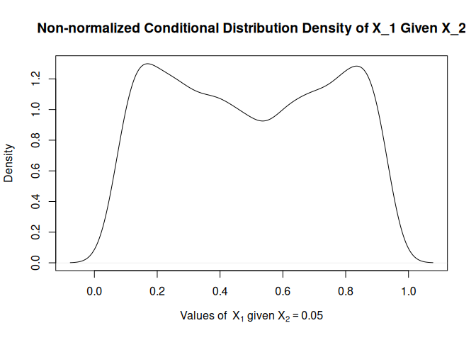

RandomSample
================

## Distribución Condicional de X_1 dado X_2.

Se establecen los valores de hiperparámetros phi=(a1,b1,c1,d1) y se
construye la gráfica de la distribución condicional de X_1 dado X_2.

``` r
a1=2.2; b1=2.2; c1=2.2; d1=2.2
Graph_Fc_X1(v1 = 0.05,"v=0.05",v2 = 0.10,"v=0.10",v3 = 0.20,"v=0.20",ae = a1,be = b1,ce = c1,de = d1)
```

<!-- -->

### Monitoreo de convergencia método de simulación

Function to monitor the acceptance rate and effective size for different
values of variance (v_values) and precision (prop_prec) provided
<!-- --><!-- -->

Function to monitor the R-Hat for different values of variance
(s_values) and precision (prop_prec) provided
<!-- --> \##
Including Code

You can include R code in the document as follows:

``` r
summary(cars)
```

    ##      speed           dist       
    ##  Min.   : 4.0   Min.   :  2.00  
    ##  1st Qu.:12.0   1st Qu.: 26.00  
    ##  Median :15.0   Median : 36.00  
    ##  Mean   :15.4   Mean   : 42.98  
    ##  3rd Qu.:19.0   3rd Qu.: 56.00  
    ##  Max.   :25.0   Max.   :120.00

## Including Plots

You can also embed plots, for example:

<!-- -->

Note that the `echo = FALSE` parameter was added to the code chunk to
prevent printing of the R code that generated the plot.
